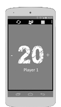
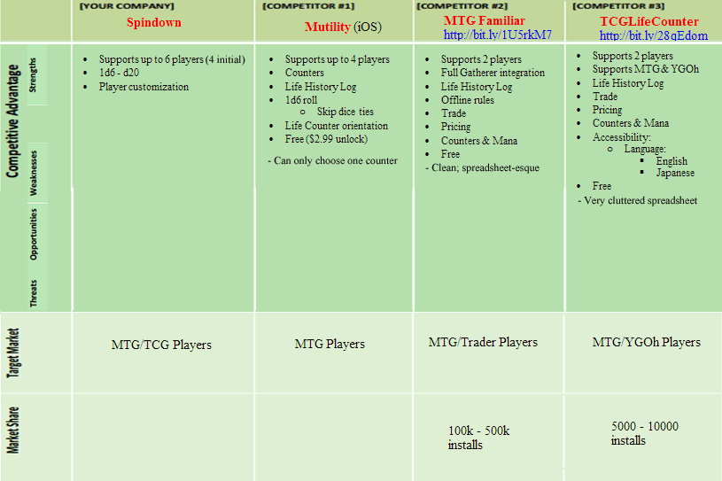

#Spindown
Winston Chang & Aaron Artea

---
##Description
Spindown started as a life counter Android application for the "Magic the Gathering" TCG (tradable card game).  The Google Play store offers many applications with similar functionality, those that are there are feature heavy, but lacked a great user experience or feature light and weren't free. We aim to satisfy this void... 
 
 ...within the allotted time of 1 week.

##Features
#####Planned (MVP - due to scope & time constraints)
- Players:
	- 1-4
	- Change (initial) Life Totals: 20 | 30 | 40 (with corresponding selection toast)
	- Reset Button

>All Customization (Primary Colors) moved to Stretch. ~W

- Dice & Coin Toss:
	- Coin & d6
	- Skips ties
- API Calls:
	- Cloudinary API to produce a Daily Random Card generator
	 or
	- Social Media integration (Posting that a game has started, etc)

###Wireframe / Mock
1. View: Default
1. Feature: Dice roll
2. Feature: Player select (1,2,3,4)
>Settings moved to Stretch / Material Design due to time constraints. ~W

 
	

##Stretch Features / Future Updates
####MTG
- Material Design:
	- Animate. All. The. Things!
	- View: Settings
		- Feature: Settings - Format selection (20,30,40,Custom)
		- Brightness Scale
- Players:
	- 5-6+
- Customization:
	- Primary Colors
	- Mana (Splits) & Block/Set Backgrounds
	- Life Counter additional orientation
	- Take a picture to set as background; use photo library
	- Dice shaker
- Accessibility:
	- Text-to-Speech 
	- Life Count 
	- Settings
	- (EXTREME STRETCH: Photo of Card recognition: Name/Cost/Type/Text/Power & Toughness; where applicable)

	
- Dice & Coin Toss: 
	- d4 | d6 - Planechase | d8 | d10 | d12 | d20
- Counters:
	- Persistent Poison & (Planeswalker) Loyalty
- History Log
- Searchable Rules Database
	- Alternate: Link that sends to WebView of Wizards' site.
- Beginner Mode Toggle (List of phases)
- Deck Builder / Booster Draft

####Yu-Gi-Oh! Integration
- Life Counter: 
	- 8000 (Normal) or 2000 (Anime) modes; user input - "glorified calculator")
- Settings
	- Set Default Game Start (MTG or Yu-Gi-Oh!)
	- Splash screen 

---

 
###Research Plan Worksheet

- 1) Research Title:
	- All-encompassing Life Counter for Android.
- 2) Authors:
	- Winston Chang
	- Aaron Artea
- 4) Background:
	- Mutility iOS inspired me to find a comparable Android equivalent. None exist or those that did were feature light in the areas that made Mutility such a greater user experience.
- 5) Goals:
	- Provide a free Life Counter (MTG, Stretch: YGOh & MTG Booster Draft) Android solution.
- 6) Research Questions:
	- What can a user expect?
	- What does the user gain from my app?
	- Does this app make it easier to track life?
	- Does this app make chaos games more bearable?
- 8) Participants / Target Audience: 
	- TCG players; especially MTG (Stretch: YGOh)
- 10) 
	- What makes MTG difficult for you?
	- How would a free life tracking app be of use to you?

###Competitive Analysis

----------
>Misc
>
> 
> 
> 
>[Spindown - Mk1](https://github.com/changwinstonr/AntediluvianYawgmoth/commits/master "Mk1")
> 
> 
> 
> 
>

